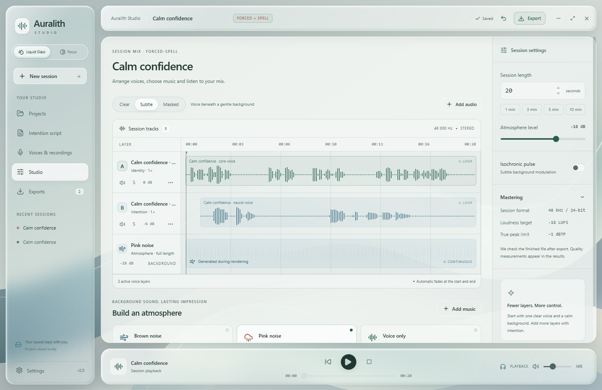
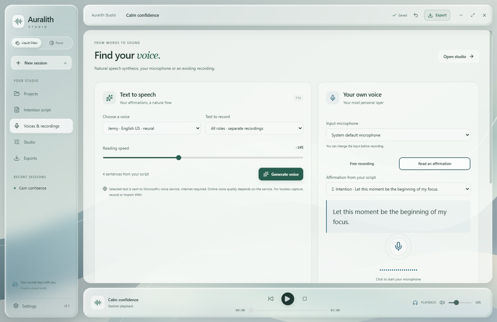
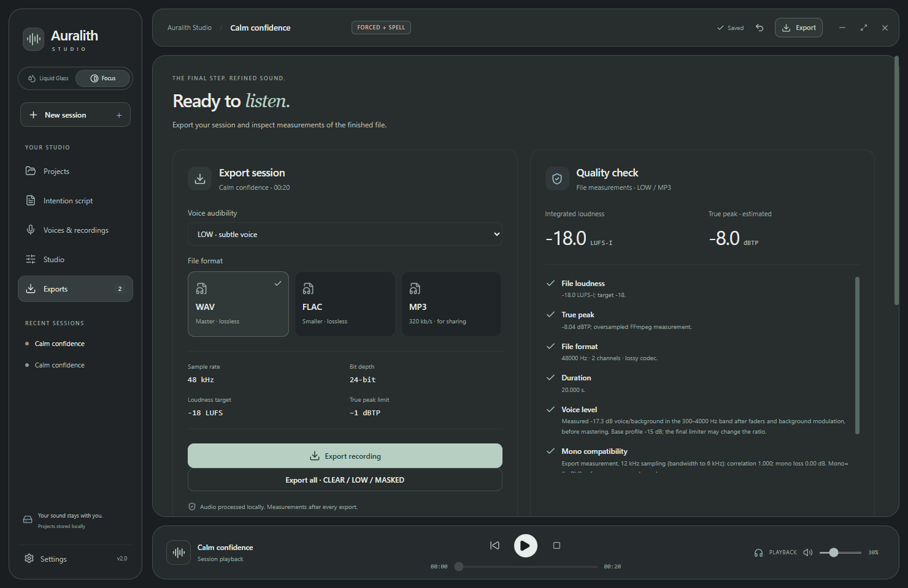

<div align="center">


# Auralith Studio

**Your words. Your voice. Your mix.**

A free, source-available Windows app for creating affirmation audio and subliminals.

[Download for Windows](https://github.com/crxptt1/Auralith/releases/latest) · [Getting started](#make-your-first-session) · [Build from source](docs/DEVELOPMENT.md) · [Changelog](CHANGELOG.md)

Windows x64 · English / Polski · Source available

</div>



## A small studio for your own recordings

Write your affirmations, give them a voice, and arrange them over music or a quiet background. Keep your projects on your computer and export a finished audio file. No account, subscription or locked features.

- **Use your own voice.** Choose a microphone and read a selected affirmation right on screen. Each take keeps the sentence's name and A/B/C role.
- **Start from text or audio.** Import TXT / Markdown, use text-to-speech, or bring in existing recordings.
- **Shape the mix.** Layer voices, adjust speed, pan and volume, reverse tracks, and add music, brown noise or pink noise.
- **Choose a writing style.** Classic, Forced, Spell and Forced + Spell are editable writing templates. Audio settings stay independent.
- **Export with useful measurements.** WAV 24-bit / 48 kHz, FLAC or MP3 320 kbps, with loudness and peak checks on the finished file.
- **Make it comfortable.** Liquid Glass or Focus, English or Polish, full or reduced animations, and an editable local library.

## More control over masking

Choose **Deep Mask** to lower voices automatically as music becomes quieter. It analyzes three speech-frequency bands in both channels and attenuates the voices; it does not make the background louder. Silent passages can silence the voices. Existing **Masked** keeps a fixed mix balance. Always preview a quiet passage: this is audio processing, not a guarantee of inaudibility or subliminal effectiveness.

Click the background track to adjust gain, mute, solo, filters, pan and fades. Imported music also supports speed and reverse. Advanced controls include a reset; the overall mix still fades at its beginning and end.

New sessions target **−24 LUFS**. Existing projects retain their settings; open **Mastering** to lower their target if needed. Playback now has finer control at low volume. In Exports, the trash button lets you remove a history entry or recycle the app-owned file. Files used by projects are protected.

## Read while you record

Choose **Voices & recordings → Read an affirmation**, select a sentence, then record. The text stays visible until you finish. The trash button removes a recording from the library; audio already attached to projects is retained.



## Make your first session

1. Download the **Setup.exe** or **Portable.exe** from [Releases](https://github.com/crxptt1/Auralith/releases/latest). Setup supports in-app updates; Portable is updated manually.
2. Create a session and open **Intention script**. Write your lines or import a text file.
3. Open **Voices & recordings**. Generate speech, record yourself, or import audio.
4. Arrange your tracks in **Studio**, choose the background and preview the mix.
5. Export your audio. Save a `.auralith` project bundle if you want to move the session and its recordings to another computer.

A text file can already include roles:

```text
a) I am comfortable speaking at my own pace.
b) I choose one clear thought before I speak.
c) I imagine finishing the conversation feeling at ease.
```

`A` = Identity · `B` = Intention · `C` = Imagination. Named sections and Markdown lists also work; the import help popup shows examples.

## Prefer a darker interface?

Switch to **Focus** in Settings for dark, opaque surfaces. Here is the export screen in Focus (screenshot from version 2.0).



The export report checks audio quality, not affirmation effectiveness.


## Local projects, clear dependencies

Projects and recordings are saved in the local data folder shown in Settings. Online neural text-to-speech sends selected text to Microsoft's voice service; the installed Windows voice works offline. If automatic update checks are enabled in the installed app, it checks this repository's public GitHub Releases. Downloads and restarts require your click.

Portable means a standalone executable: its project data still lives in your Windows user profile. Use project bundles when moving between computers.

This is an audio creation tool. Forced and Spell name creative writing styles; they do not reproduce a creator's proprietary formula or establish supernatural effects.

## Source and permissions

The source is public for inspection and private use under the [Auralith Source-Available License](LICENSE). You may build and modify it privately; publishing modified versions or distributing copies requires prior written permission. GitHub platform fork permissions remain governed by its terms. FFmpeg and other dependencies retain their own licenses; see [third-party notices](THIRD_PARTY_NOTICES.md).

```powershell
npm ci
# Add the documented FFmpeg build at vendor/ffmpeg.exe first.
npm run build
npm start
```

Read [development instructions](docs/DEVELOPMENT.md) for tests and packaging, or [release instructions](docs/RELEASING.md) for GitHub updates.

Found a bug? [Open an issue](https://github.com/crxptt1/Auralith/issues) with your app version, what you were doing and what happened.

## Support & other projects

All features are free. Optional support: [Ko-fi](https://ko-fi.com/piotrkolodz) · [PayPal](https://www.paypal.com/paypalme/piotrkolodz).

Also by me: [Innerverse](https://crxptt1.github.io/manifestapp/), a separate manifestation project.

Previously distributed copies retain their original license rights. The source license change does not retroactively change the terms of the already published 2.1.1 executables. Third-party license terms remain unchanged.
